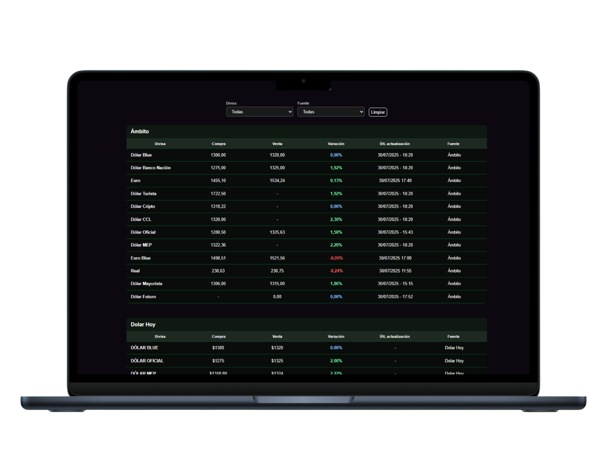

# 💸 DivisasScraper

DivisasScraper es una aplicación full stack que obtiene y muestra cotizaciones de monedas como el dólar, euro, real, entre otras, en tiempo real. 
Utiliza web scraping con Puppeteer para extraer información de sitios como Ámbito Financiero, Dólar Hoy y La Nación, guardandola en una base de datos MongoDB, y mostrandola en una interfaz construida en Next.js + Tailwind CSS.

-------------------------------------------------------------

🛠️ Stack Tecnológico

Frontend:
- ✅ Next.js + React
- ✅ Tailwind CSS
- ✅ Axios para peticiones HTTP

Backend:
- ✅ Node.js + Express
- ✅ Web Scraping con Puppeteer
- ✅ MongoDB
- ✅ node-cron para tareas programadas

---

## 📸 Vista previa

---

## ⚙️ Funcionalidades

- 🔍 Filtros por divisa (Dólar, Euro, etc.) y fuente (Ámbito, Dólar Hoy, etc.)
- 💾 Persistencia en MongoDB.
- 🤖 Scraping programado con node-cron cada 5 minutos que actualiza los datos.
- 🌓 Interfaz dark minimalista y responsive
- 🔁 Limpieza automática de filtros